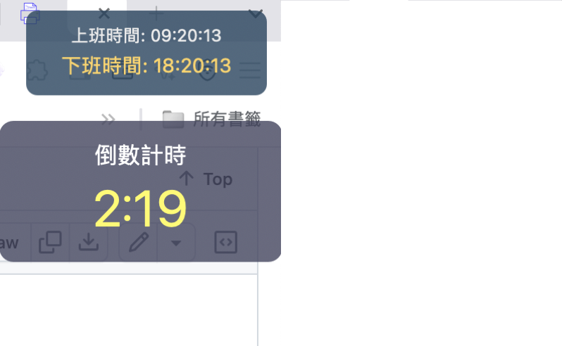

# Make-Leave-Work-On-Time-Great-Again

# Hammerspoon 工作時間追蹤工具

這個專案提供一個 Hammerspoon 配置，用於自動追蹤上下班時間。

## 安裝說明

### 步驟 1: 安裝 Hammerspoon

1. 下載 Hammerspoon
   - 前往 [Hammerspoon 官網](https://www.hammerspoon.org/) 下載最新版本
   - 或使用 Homebrew: `brew install --cask hammerspoon`

2. 啟動 Hammerspoon
   - 在應用程式資料夾中開啟 Hammerspoon
   - 首次啟動時，可能需要授予輔助功能權限

### 步驟 2: 設置配置檔

1. 找到 Hammerspoon 配置資料夾
   - 預設路徑: `~/.hammerspoon/`
   - 如果資料夾不存在，請創建: `mkdir -p ~/.hammerspoon`

2. 安裝此專案檔案
   - 將本專案中的 `init.lua` 複製到 `~/.hammerspoon/` 資料夾
   - 複製命令: `cp init.lua ~/.hammerspoon/`

### 步驟 3: 設置音效檔案

1. 安裝音效檔案
   - 將專案中的音效檔案複製到 `~/.hammerspoon/` 資料夾中
   - 複製命令: `cp *.mp3 ~/.hammerspoon/`

### 步驟 4: 重新加載 Hammerspoon

1. 點擊螢幕頂部選單列的 Hammerspoon 圖示
2. 選擇 "Reload Config"
3. 配置加載成功後會顯示通知

## 使用方法

- 系統解鎖時會自動記錄上班時間（僅限每日首次）
- 查看記錄: 工作時間日誌保存在 `~/.hammerspoon/logs` 資料夾
- 手動觸發: 可通過選單列 Hammerspoon 圖示操作

## 自定義配置

如需修改預設行為或自定義功能，請編輯 `~/.hammerspoon/init.lua` 檔案。
